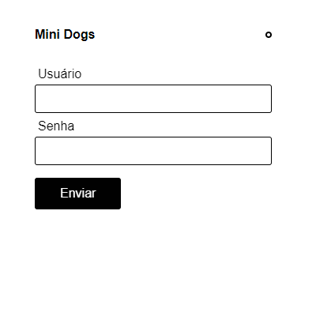
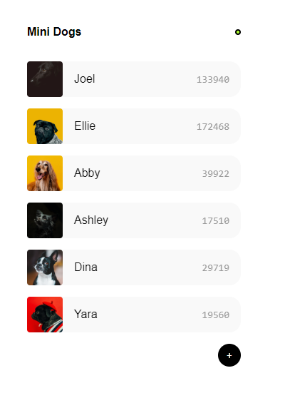

# Mini Dogs

Lista de fotos da rede social fictícia Dogs.

## Descrição do projeto: 

Desenvolvido como parte do curso de "Redux com React" da Origamid, com o objetivo de fixar os conceitos para gerencialmento do estado da aplicação utilizando a bibilioteca Redux. 

## Funcionalidades do projeto

* `Funcionalidade 1`: Autenticar / Logar usuário;
* `Funcionalidade 2`: Visualizar lista de fotos dos usuários;

## Demo:
#### Tela de login

#### Tela da lista de fotos


## Instação:

### Clonar o repositório:
```
$ git clone https://github.com/albertoafaj/mini-dogs-react-redux.git
```
### Instalar as dependências:
```
$ npm install
```
### Rodando a aplicação:
```
$ npm start
```
* Logar com o usuário padrão {name: dog, passwd: dog}
* Clicar no botão "+" para carregar mais fotos

## Tecnologias utilizadas

* ReactJs
* Redux
* HTML 5
* CSS
